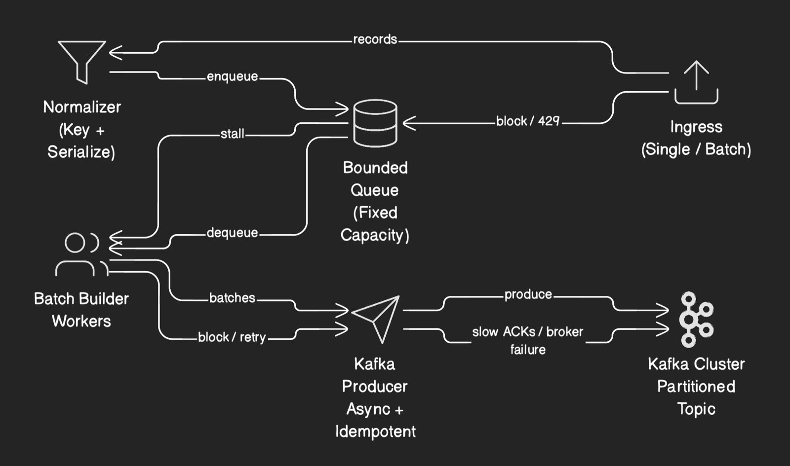
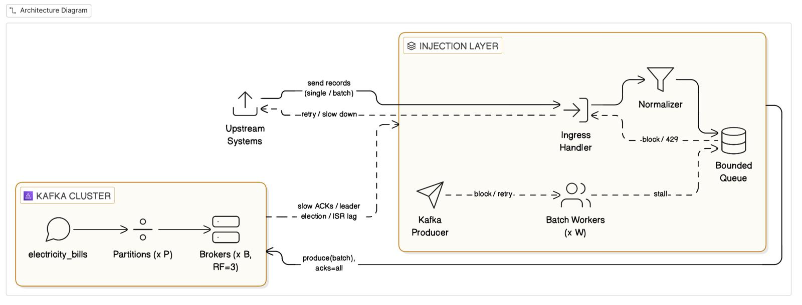

## Kafka-Injector

- High‑throughput HTTP → Kafka injector written in Go. Designed for low‑latency batching, backpressure safety, and first‑class observability with Promethe

### HLD (High-Level-Design )

After scaling for 1M-3M events/minute :

Running locally

`docker-compose up`

- Injector: http://localhost:8080
- Metrics:  http://localhost:8080/metrics
- Prometheus: http://localhost:9090